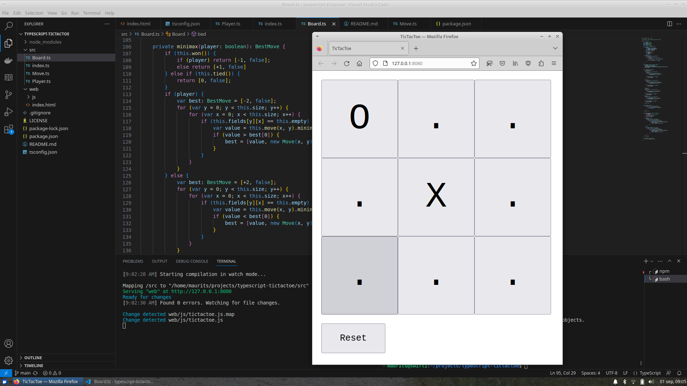

# TicTacToe in TypeScript

This is TicTacToe written in TypeScript. I ported the code from my previous [Python implementation](https://github.com/mevdschee/python-tictactoe).

### Quick start

Type the following commands to get started:

    git clone git@github.com:mevdschee/typescript-tictactoe.git
    cd typescript-tictactoe
    curl -o- https://raw.githubusercontent.com/nvm-sh/nvm/v0.39.5/install.sh | bash
    nvm install node
    npm install
    npm run dev

Now use Visual Studio Code (with the TypeScript extension) to edit the content and see how the code is recompiled and the browser is reloaded when the code is saved.

### Motivation

I tried to make a small starter project for your/my own games. By cloning this starter you should be able to create more complex games. Check out [AceCardGames.com](https://www.acecardgames.com/) to get an idea of what you could be building and clone my small starter project and get creative with your own ideas and designs.
